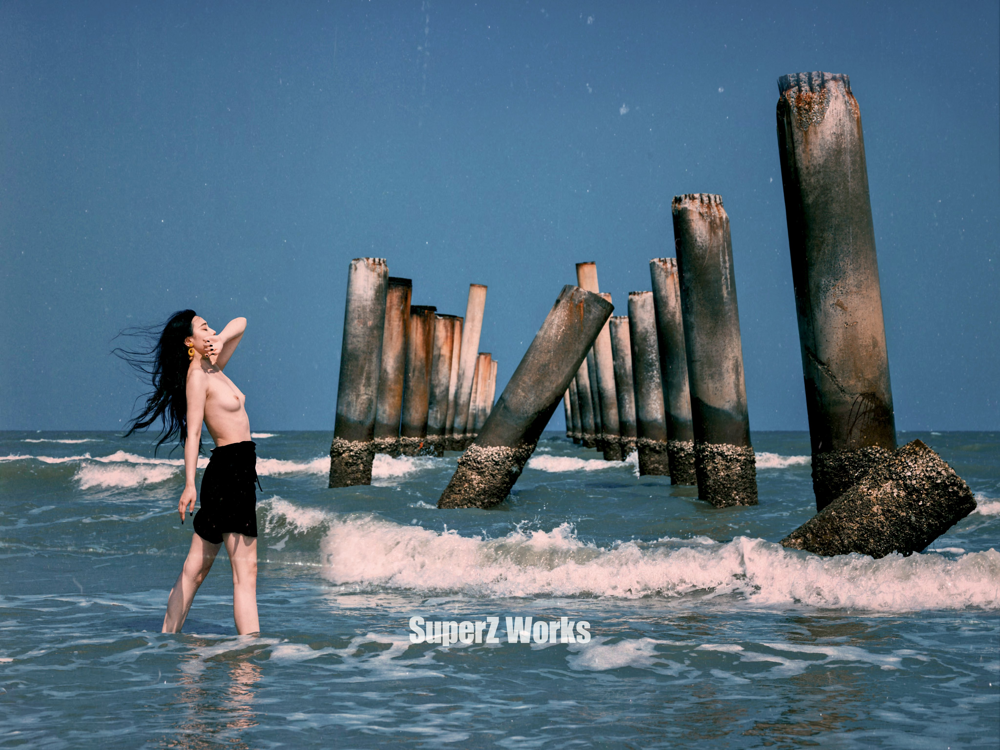

>  Quick Start


tools

base58: https://www.metools.info/code/c74.html

mp4 -> gif : https://www.freeconvert.com/zh/convert/mp4-to-gif


# 本站配置


博客框架 [jekyll](http://jekyllthemes.org/)

采用主题： [agusmakmun](https://github.com/agusmakmun/agusmakmun.github.io) ， 通过博主**enovella_**发现的这个简洁主题

其它主题推荐 [huxpro](https://github.com/Huxpro/huxpro.github.io), [chirpy](https://github.com/cotes2020/jekyll-theme-chirpy/)

直接去[jekyll](http://jekyllthemes.org/)下载博客模板 , 之后只需要在模板修改内容, git上传即可


图床问题？

使用 public repository +  page + raw.githubusercontent.com

图片链接替换

```
./img/ 
==>
https://raw.githubusercontent.com/redqx/redqx.github.io/master/_posts/img/ 
```


test img show 图床测试





> ssh上传

为什么不用https,这个老是出现问题.

好吧也不能这样说,应该说 ssh出现问题就用https

```
git remote set-url origin git@github.com:i1oveyou/i1oveyou.github.io.git
```


>  upload

```
git add .
git commit -m "happy every day"
git push -u origin master
```


## 页脚的GitHub


> _layouts\default.html


```
<div class="btn-github" style="float:right;">
<iframe src="https://ghbtns.com/github-btn.html?user=enovella&repo=enovella.github.io&type=star&count=true" frameborder="0" scrolling="0" width="85" height="20px"></iframe>
<iframe src="https://ghbtns.com/github-btn.html?user=enovella&repo=enovella.github.io&type=fork&count=true" frameborder="0" scrolling="0" width="85" height="20px"></iframe>

===>改为   
<div class="btn-github" style="float:right;">
<iframe src="https://ghbtns.com/github-btn.html?user=i1oveyou&repo=i1oveyou.github.io&type=star&count=true" frameborder="0" scrolling="0" width="85" height="20px"></iframe>
<iframe src="https://ghbtns.com/github-btn.html?user=i1oveyou&repo=i1oveyou.github.io&type=fork&count=true" frameborder="0" scrolling="0" width="85" height="20px"></iframe>
</div>
```


## toc 文章目录配置


 _layouts\post.html

https://github.com/allejo/jekyll-toc

https://www.70apps.com/blog/code/2021/10/27/JEKYLL_TOC_THEME.html

只需要在xx出添加一句`<div class="content_toc"></div>`

如下所示

```
<div class="content_toc"></div>

<div class="content">
  <div class="post">{{ content }}</div>
  
</div>
```


## avatar头像配置


> _layouts\default.html


```
<a href="/"></a>
===>改为
<a href="/"></a>
```


>  static\css\main.css


```
div.col-sm-3 img.profile-avatar {
  border-radius: 150px;
  -webkit-border-radius: 150px;
  -moz-border-radius: 150px;
  -ms-border-radius: 150px;
  -o-border-radius: 150px;
  margin-left: auto;
  margin-right: auto;
}
      
 ===>改为 

div.col-sm-3 img.profile-avatar {
/*  border-radius: 150px;
  -webkit-border-radius: 150px;
  -moz-border-radius: 150px;
  -ms-border-radius: 150px;
  -o-border-radius: 150px;*/
  margin-left: auto;
  margin-right: auto;
}
```


## 字体


在 `_layouts\default.html`

```
---
<!DOCTYPE html>
<html>
  <head>
    <meta charset="utf-8">
    <meta http-equiv="X-UA-Compatible" content="IE=edge,chrome=1">
    <meta name="viewport" content="width=device-width, initial-scale=1">
    <link rel="shortcut icon" href="/static/img/favicon.ico"/>
    <link rel="stylesheet" href="https://npm.elemecdn.com/lxgw-wenkai-screen-webfont/style.css" media="print" onload="this.media='all'"> => 添加部分
```

ps: 图床使用的是他人的cdn加速，可能会挂掉


在 `static\css\main.css`

```css

body {
  font-family: "LXGW WenKai Screen","Roboto Condensed", Arial, sans-serif;
  background: url("/static/img/subtle_dots.png");
  line-height: 1.5em;
  font-weight: 300;
  font-size: 16px;
  color: #666;
}
```

