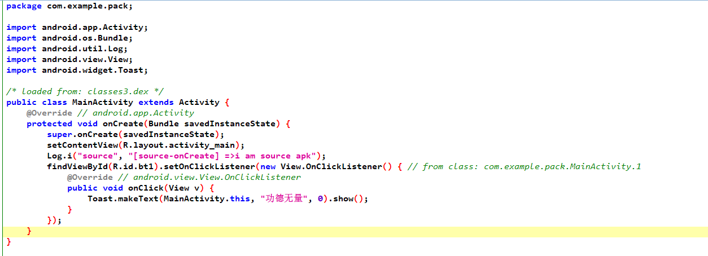
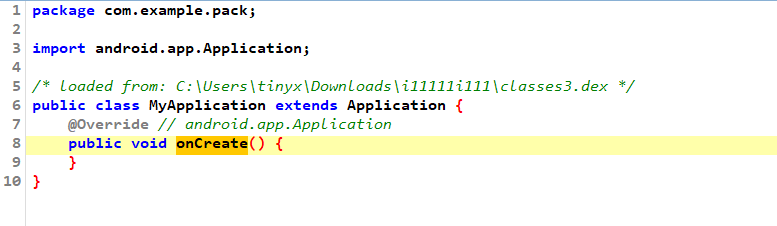
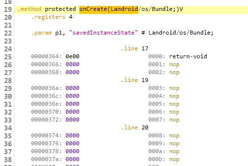

# 序言

这个项目[Second_generation_shell](https://github.com/Huyehan/Second_generation_shell) 想要在JNILoad的时候,读取 libdvm.so 的符号结构体dvm_dalvik_system_DexFile

并从dvm_dalvik_system_DexFile拿掉函数指针 `openDexFile","([B)I"`

可是拿找不到模块libdvm.so , 呃....我调试返回的是NULL

后来得知libdvm.so 是dvm虚拟机的,我们应该去拿libart.so

可是我dlopen libart.so也拿不到,,,,呃,


另外一个项目(有时间看看): https://github.com/KuNgia09/Bangcle

ref: 

https://tttang.com/archive/1728/


GitHub项目: [dpt-shell](https://github.com/luoyesiqiu/dpt-shell)

ps: 这是一个IDEA项目,我还以为是Android项目, 但Android Studio以及IDEA都可以对该项目build, 调试的话我还是用IDEA

项目作者之项目分析介绍: https://www.52pojie.cn/thread-1576245-1-1.html


项目特点:

- 采用了很多第三方框架(站在巨人的肩膀上)
  - 使用 [ManifestEditor](https://github.com/WindySha/ManifestEditor) 处理AndroidManifest.xml解包写入
  - 使用 [dx](https://android.googlesource.com/platform/dalvik/+/refs/heads/master/dx/) 可以很方便的读取dex文件的各个部分。
  - 使用Hook框架 [Dobby](https://github.com/jmpews/Dobby) 
  - 使用 Hook框架  [bhook](https://github.com/bytedance/bhook)


加壳前的函数



加壳后的函数




他对函数的所有字节码给nop掉了,差不多是这种形式




# 项目dpt

```
app-debug_unzipalign.apk
app-debug_unsign.apk
app-debug_signed.apk
```


该项目是加壳器,是起主要作用的模块.

同时该项目有很多参数执行的逻辑

```
usage: java -jar dpt.jar [option] -f <apk>
 -c,--disable-acf      Disable app component factory(just use for debug).
 -d,--dump-code        Dump the code item of DEX and save it to .json
                       files.
 -D,--debug            Make apk debuggable.
 -f,--apk-file <arg>   Need to protect apk file.
 -l,--noisy-log        Open noisy log.
 -x,--no-sign          Do not sign apk.
```

我们主要分析命令行`java -jar dpt.jar -f /path/to/apk`的执行逻辑部分

该指令会对apk分解,处理,打包,重签名.


processor是可以将普通apk处理成加壳apk的模块。它的主要功能有：

- 解压apk
- 提取apk中的dex的CodeItem保存起来
- 修改AndroidManifest.xml中的Application类名
- 生成新的apk

主要流程


 

分析方法: 代码量很大,所以会很多函数功能要么靠猜,要么是调试出来的


首先是main函数

```java
    public static void main(String[] args)
    {
        try {
            Apk apk = parseOptions(args);//大概是 对参数路径的apk做一个信息的提取
            apk.protect();//开始执行加壳
        } catch (Exception e){

        }
    }
```

进入`apk.protect()` 


该项目会调用 `Apk.buildApk(String originApkPath,String unpackFilePath,String savePath)` 对新的apk进行签名


# 子项目shell

dpt是加壳项目

而shell模块就是一个运行中自动脱壳的项目


ps:  再看看这2篇文章

[[原创]Android漏洞之战（11）——整体加壳原理和脱壳技巧详解](https://bbs.kanxue.com/thread-273293.htm)

[[原创]Android加壳脱壳学习（1）——动态加载和类加载机制详解](https://bbs.kanxue.com/thread-271538.htm)


shell模块最终生成的dex文件和so文件将被集成到需要加壳的apk中。它的要功能有：

- 处理App的启动
- 替换dexElements
- hook相关函数
- 调用目标Application
- CodeItem文件读取
- CodeItem填回


当一个类被加载的时候，它的调用顺序是这样的(部分流程已省略)：

1. ClassLoader.java::loadClass
2. DexFile.java::defineClass
3. class_linker.cc::DefineClass
4. class_linker.cc::LoadClass
5. class_linker.cc::LoadClassMembers
6. class_linker.cc::LoadMethod


# 子项目junkcode
