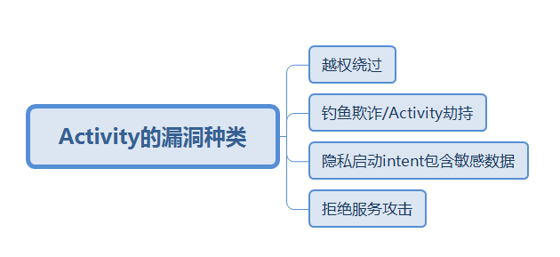
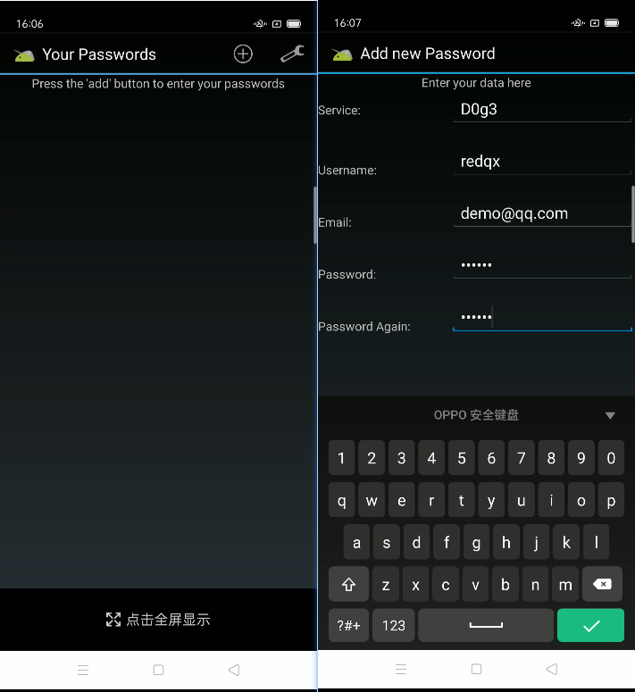

# 序言

参考文章: https://bbs.kanxue.com/thread-269211.htm

[《Android APP漏洞之战系列》](https://github.com/WindXaa/Android-Vulnerability-Mining)

**Activity的漏洞种类**



**Activity安全场景和危害**

Activity的组件导出，一般会导致的问题：Android Browser Intent Scheme URLs的攻击手段
(1)拒绝服务攻击：通过Intent给Activity传输畸形数据使得程序崩溃从而影响用户体验
(2)越权攻击：Activity用户界面绕过会造成用户信息窃取、Activity界面被劫持产生欺诈等安全事件
(3)组件导出导致钓鱼欺诈
(4)隐式启动intent包含敏感数据


# 越权绕过

**原理介绍**

在Android系统中，Activity默认是不导出的，如果设置了exported = "true" 这样的关键值或者是添加了<intent-filter>这样的属性


```
<activity 
    android:label="@string/title_activity_pwlist" 
    android:name="com.mwr.example.sieve.PWList" 
    android:exported="true" //可能危险的地方
    android:finishOnTaskLaunch="true" 
    android:clearTaskOnLaunch="true" 
    android:excludeFromRecents="true"
/>
```


那么此时Activity是导出的，就会导致越权绕过或者是泄露敏感信息等安全风险。

例如：
(1)一些敏感的界面需要用户输入密码才能查看，如果没有对调用此Activity的组件进行权限验证，就会造成验证的越权问题，导致攻击者不需要密码就可以打开
(2)通过Intent给Activity传输畸形数据使得程序崩溃拒绝服务
(3)对Activity界面进行劫持


样本 sieve.apk ==> com.mwr.example.sieve

附件: 链接: https://pan.baidu.com/s/1uvZZxTMsCQ1sz74FnqFzTg?pwd=feav 提取码: feav

启动 `drozer`, 查询目标应用的攻击面

```
dz> run app.package.attacksurface com.mwr.example.sieve
Attempting to run shell module
Attack Surface:
  3 activities exported
  0 broadcast receivers exported
  2 content providers exported
  2 services exported
    is debuggable
```

再具体查询暴露activity的信息

```
dz> run app.activity.info -a  com.mwr.example.sieve
Attempting to run shell module
Package: com.mwr.example.sieve
  com.mwr.example.sieve.FileSelectActivity
    Permission: null
  com.mwr.example.sieve.MainLoginActivity
    Permission: null
  com.mwr.example.sieve.PWList
    Permission: null
```

说明我们可以通过强制跳转其他两个界面，来实现越权绕过

其中`com.mwr.example.sieve.MainLoginActivity`是启动的activity

```
dz> run app.activity.start --component com.mwr.example.sieve com.mwr.example.sieve.PWList
Attempting to run shell module
```

我们尝试启动sieve.apk的`com.mwr.example.sieve.PWList`




说明我们成功的实现了越权绕过,

ps: 我点击save,显示 can not connect the service.


防护策略：

(1)私有Activity不应被其他应用启动相对是安全的，创建activity时：设置exported属性为false
(2)公开暴露的Activity组件，虽然可以被任意应用启动，创建Activity：设置export属性为true，但谨慎处理接收的Intent，有返回数据不包含敏感信息，不应发送敏感信息，收到返回数据谨慎处理

# 钓鱼欺诈/Activity劫持

**原理介绍：**
（1）Android APP中不同界面的切换通过Activity的调度来实现，而Acticity的调度是由Android系统中的AMS来实现。每个应用想启动或停止一个进程，都报告给AMS，AMS收到启动或停止Activity的消息时，先更新内部记录，再通知相应的进程或停止指定的Activity。当新的Activity启动，前一个Activity就会停止，这些Activity会保留在系统中的一个Activity历史栈中。每有一个Activity启动，它就压入历史栈顶，并在手机上显示。当用户按下back，顶部的Activity弹出，恢复前一个Activity，栈顶指向当前的Activity。
（2）由于Activity的这种特性，如果在启动一个Activity时，给它加入一个标志位FLAGACTIVITYNEW_TASK,就能使它置于栈顶并立马呈现给用户，如果这个Activity是用于盗号的伪装Activity，就会产生钓鱼安全事件或者一个Activity中有webview加载，允许加载任意网页都有可能产生钓鱼事件。


**实现原理：**

如果我们注册一个receiver，响应android.intent.action.BOOT_COMPLETED，使得开启启动一个service；这个service，会启动一个计时器，不停枚举当前进程中是否有预设的进程启动，如果发现有预设进程，则使用FLAG_ACTIVITY_NEW_TASK启动自己的钓鱼界面，截获正常应用的登录凭证


**实现步骤：**

(1)启动一个服务
(2)不断扫描当前进程
(3)找到目标后弹出伪装窗口

# 隐私启动Intent包含敏感数据

# 拒绝服务攻击